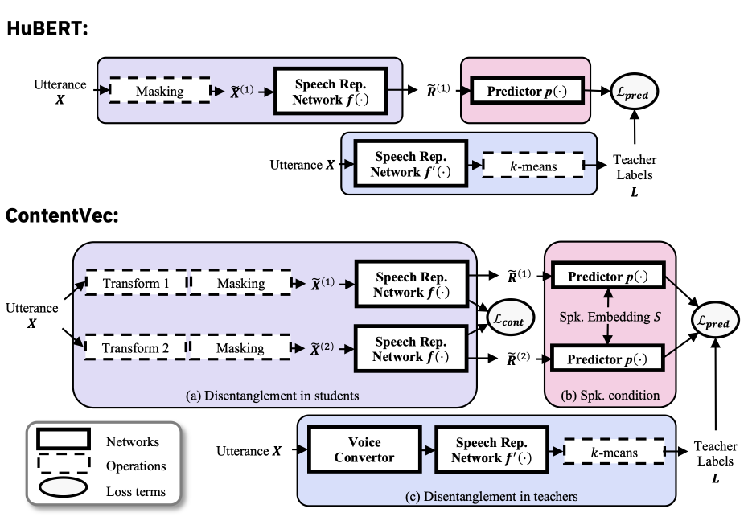
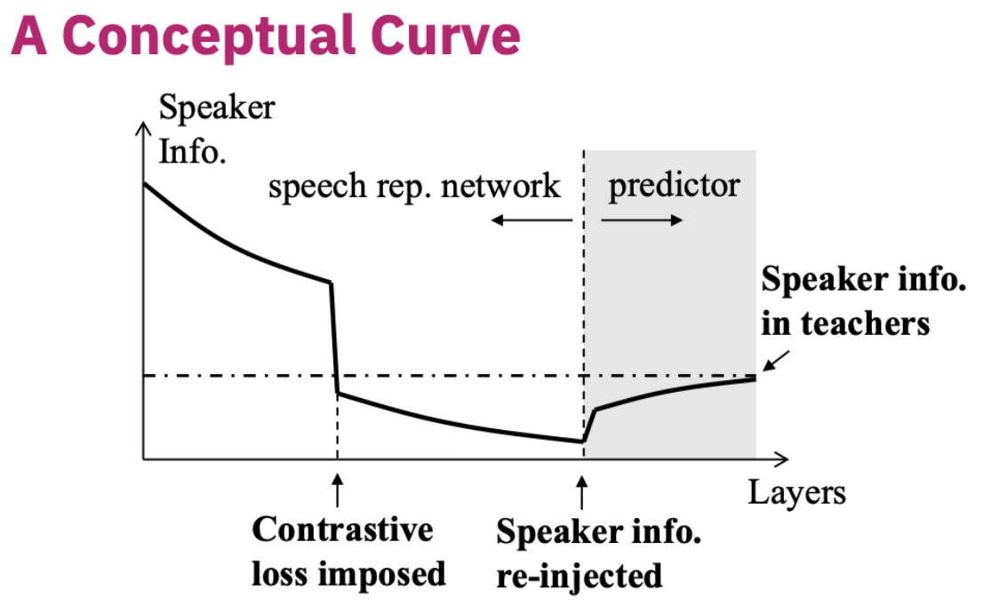
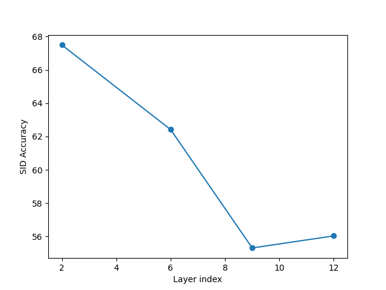

## ASR HACKER Assignment
-   Adyasha Patra (210050007)
-   Ankan Sarkar  (210050013)
-   Govind Kumar  (210050058)
-   Harsh Poonia  (210050063)
## ContentVec: An Improved Self-Supervised Speech Representation by Disentangling Speakers




To setup the initial code base:
```bash
git clone
cd contentvec
./setup.sh
```

### Speaker Information in Speech Representation

The paper discussed a theoretical curve of how speaker information gets disentangled throught the layers.



We tried to reproduce this by testing the model at intermediate layers on Speaker Identification (SID) task.

The following is the result of the experiment:



The experiments were run by training for 50000 steps on the VoxCeleb1 dataset.

The observations are:
- The SID accuracy decreases as we move deeper into the model. This is expected from the conceptual curve.

- The SID accuracy reaches a minima around layer 8. This is also expected as the contrastive loss was applied on the 8th layer.


### Evaluation on SID task

SID task accuracy can be taken as a measure of speaker information available in the representation. We take this as a pseudo measure of speaker disentanglement.

#### Data preparation

#### Prepare data

1. Download dataset from [Voxceleb1](https://www.robots.ox.ac.uk/~vgg/data/voxceleb/vox1.html) and unzip them.

```bash
./download_sid_data.sh
```

2. Change the path in `downstream/voxceleb1/config.yaml`

```yaml
downstream_expert:
    datarc:
        file_path: "root directory of VoxCeleb1"    
```

#### Training and testing

For output from the last layer of the model:
```bash
PYTHONPATH=../ python3 run_downstream.py -n exp_id -m train -u contentvec -d voxceleb1
PYTHONPATH=../ python3 run_downstream.py -m evaluate -e result/downstream/exp_id/dev-best.ckpt
```

For output from the last `i`th layer of the model:
```bash
PYTHONPATH=../ python3 run_downstream.py -n exp_id -m train -u contentvec -d voxceleb1 -s hidden_states -l -$i
PYTHONPATH=../ python3 run_downstream.py -m evaluate -e result/downstream/exp_id/dev-best.ckpt
```


### Pretraining the model
For a fresh pretraining with the proposed changes, follow the steps below:

#### Data preparation
Download the [zip file](https://ibm.box.com/s/zeyr94mkfs2g896oug31ml0gxv5ny43y) consisting of the following files:
- `{train,valid}.tsv` waveform list files in metadata
- `{train,valid}.km` frame-aligned pseudo label files in labels
- `dict.km.txt` a dummy dictionary in labels
- `spk2info.dict` a dictionary mapping from speaker id to speaker embedding in metadata

Modify the root directory in the `{train,valid}.tsv` waveform list files

#### Pretraining
To pretrain the setup, use `run_pretrain_single.sh` to run on a single node


### Credits
[ContentVec](https://github.com/auspicious3000/contentvec)
[SuperB](https://github.com/s3prl/s3prl)